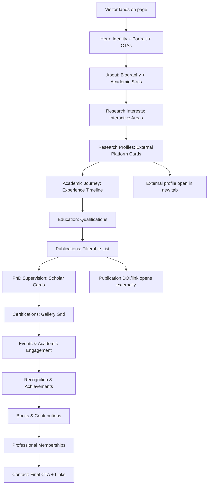

## 1. Product Overview

Premium single-page academic portfolio website for Dr. Golda Dilip, Professor & Head of the Department of Computer Science & Engineering at SRM Institute of Science and Technology, Vadapalani Campus. The website showcases her academic career, research publications, PhD supervision, achievements, certifications, and professional research profiles in an elegant, contemporary, and highly polished digital experience.

- **Purpose**: Establish a distinguished, professional digital presence that communicates academic credibility, research leadership, and scholarly excellence
- **Target Users**: Academic peers, research collaborators, prospective PhD students, university administration, conference organizers, and professional networks
- **Value**: A significantly upgraded, memorable personal brand presence compared to generic university faculty pages

---

## 2. Core Features

### 2.1 User Roles

| Role | Registration Method | Core Permissions |
|------|---------------------|------------------|
| Visitor | No registration required | Browse all sections, view publications, access external research profile links, contact via email |

### 2.2 Feature Modules

1. **Landing / Hero**: Asymmetric editorial composition with professional portrait, identity, introduction, and primary CTAs
2. **Navigation**: Premium sticky navbar with scroll transition, mobile hamburger menu, and Download CV button
3. **About**: Two-column editorial biography with academic statistics highlights
4. **Research Interests**: Interactive research area cards/tags with hover states
5. **Research Profiles**: Four prominent cards for Scopus, Google Scholar, Vidwan, and ORCID
6. **Academic Experience**: Vertical timeline of career progression
7. **Education**: Qualifications displayed as refined editorial rows/cards
8. **Publications**: Year-filtered editorial list of publications with expandable details and external links
9. **PhD Supervision**: Research scholar cards with statistics
10. **Certifications**: Responsive gallery grid with modal/new-tab viewing
11. **Events & Engagement**: Timeline of conferences, workshops, FDPs, and invited talks
12. **Awards & Achievements**: Featured composition layout highlighting recognition
13. **Books & Contributions**: Editorial book-shelf showcase with cover prominence
14. **Professional Memberships**: Restrained logo/text membership display
15. **Contact**: Final CTA section with email, institution details, and profile links
16. **Footer**: Minimal premium footer with copyright and profile links

### 2.3 Page Details (Single-Page Experience)

| Section | Module Name | Feature Description |
|---------|-------------|---------------------|
| Hero | Portrait + Identity | Asymmetric two-column layout, eyebrow label, large heading name, role/institution lines, 2–4 line intro, 2 CTAs ("Explore My Research", "View Publications"), Research Profiles link, editorial portrait with sophisticated border/shadow, floating academic label, subtle data/network background motifs, scroll indicator |
| Navbar | Navigation | Sticky, transparent-to-glass/solid transition on scroll, logo (GD / GOLDA DILIP), nav links (About, Research, Experience, Publications, Supervision, Achievements, Contact), Download CV button, smooth hover states, mobile hamburger with animated menu |
| About | Bio + Stats | Two-column editorial: section number "01" + heading on left; multi-paragraph bio on right; compact academic stats grid below (Years in Academia, PhD Scholars Completed, Publications count, Research Scholars) |
| Research Interests | Interactive Tags | Section heading + subheading, 6 research area cards (AI, ML, Data Science, Data Mining & Analytics, Blockchain, Network Security), refined typography, subtle hover animations, minimal abstract graphics |
| Research Profiles | Four Cards | Scopus, Google Scholar, Vidwan, ORCID cards with platform name, short description, external link icon, "Visit Profile" CTA, official brand styling, external links open in new tab |
| Academic Experience | Vertical Timeline | Chronological timeline with year/duration, position, institution, optional short description, scroll-triggered animations |
| Education | Qualification Cards | Ph.D., M.Tech, M.E., B.E. displayed as refined cards/editorial rows with institution and year |
| Publications | Filterable List | Year/category/research-area filters (minimum year filter), expandable editorial cards showing title, authors, venue, year, DOI/link, "View All Publications" CTA |
| PhD Supervision | Scholar Cards | "02 PhD Scholars Completed" highlight, scholar cards (name, research area, year, status), ongoing scholars if available |
| Certifications | Gallery Grid | Responsive grid, certificate thumbnails + titles + issuing org + year + "View Certificate", PDF/image/external URL support, modal/new-tab opening |
| Events & Engagement | Timeline/Cards | Conferences, workshops, FDPs, seminars, invited talks, editorial timeline or sophisticated card layout, photo support |
| Awards & Achievements | Featured Layout | Large featured achievement + smaller achievements arranged around it, elegant cards, restrained iconography |
| Books & Contributions | Book Showcase | Authored books with title, ISBN, publication info, year, cover images, editorial bookshelf layout |
| Professional Memberships | Membership List | IEEE, ACM, ISTE, IAENG, IET restrained logo/text treatment (only confirmed memberships) |
| Contact | Final CTA | "Let's Connect" heading, short copy, email/institution/department/location, research profile links |
| Footer | Footer | Name, role, dept, institution, profile links, copyright © 2026 |

---

## 3. Core Process

**Main User Flow**: Visitor lands on hero section → Reads identity/intro → Scrolls to explore about, research, and publications → Navigates to external research profiles (Scopus, Scholar, etc.) via cards or footer → Views detailed academic journey (experience, education, supervision) → Explores achievements and certifications → Reaches contact section for collaboration inquiries.

---

## 4. User Interface Design

### 4.1 Design Style

**Aesthetic Direction**: Elegant + Academic + Contemporary + Intelligent + Premium — editorial magazine meets sophisticated researcher portfolio.

- **Color System**: Deep navy/midnight blue primary, warm white/ivory background, soft neutral gray, muted blue accent, restrained gold for premium details. Extremely subtle gradients only.
- **Typography**: Modern sans-serif for UI/body; elegant serif or sophisticated display font for major headings. Maximum 2 font families. Large display headings, refined editorial hierarchy, highly readable body text.
- **Spacing**: Generous whitespace, editorial margins, asymmetric layouts, section numbering, thin divider lines.
- **Cards/Components**: Refined thin borders, restrained shadows, subtle hover elevation transitions, asymmetric corner treatments for hero portrait.
- **Icons**: Lucide React icons, restrained usage (not every item gets an icon), minimal abstract graphics preferred.
- **Background Motifs**: Extremely subtle network/grid/connected-node graphics inspired by research and computational structures — no glowing hacker-style elements.

### 4.2 Page Design Overview

| Section | Module Name | UI Elements |
|---------|-------------|-------------|
| Hero | Editorial Portrait Layout | Asymmetric 2-col, navy bg with subtle network motifs, ivory text, serif display heading "Dr. Golda Dilip", portrait with custom asymmetric crop + refined border + shadow + floating "CSE • SRMIST" label, staggered text reveal animation, smooth scroll indicator |
| Navbar | Transparent-to-Glass | Sticky positioning, initial transparent over hero → blurred/glass bg on scroll, animated underline on nav hover, "GD" monogram logo, thin underline "Download CV" |
| About | Two-Column Editorial | Large "01" section number, serif heading, multi-paragraph bio on right, stats grid with large numerals + labels, thin divider lines |
| Research Interests | Tag Grid | 6 interactive cards with muted navy/ivory palette, subtle hover lift, refined typography without cheesy icons, connected grid background motif |
| Research Profiles | Four Premium Cards | Each platform gets its own brand-tinted card (Scopus orange, Scholar blue, etc.), icon + platform name, short description, external arrow icon, "Visit Profile" with arrow micro-interaction |
| Experience | Vertical Timeline | Central thin line with nodes on scroll, year labels, position/institution cards staggered left/right, scroll-triggered reveal |
| Education | Structured Rows | Card rows with qualification (Ph.D., etc.) left, details (CSE, institution, year) right, academic cap visual motif |
| Publications | Filterable Editorial List | Year filter chips at top, expandable year-grouped cards with title (strong), authors (muted), venue (italic), DOI link with arrow, subtle border hover highlight |
| PhD Supervision | Research Cards | Large "02" stat with "PhD Scholars Completed", individual scholar research cards with name + area + status + year |
| Certifications | Visual Gallery | Responsive 2–3 col grid, thumbnail images + title + issuer, "View Certificate" with arrow, hover subtle zoom |
| Events | Timeline | Editorial timeline with dates, event type tags, title, location/description |
| Achievements | Featured Composition | Large featured achievement card left, 2–4 smaller achievement cards stacked right, gold accent for medals/excellence |
| Books | Editorial Showcase | Book cover thumbnails prominent, title, ISBN, publisher, year, bookshelf-style horizontal row or asymmetric grid |
| Memberships | Minimal List | Row of restrained logos/text (IEEE, ACM, etc.) — not a loud logo wall, fine separator lines |
| Contact | Large Final CTA | Deep navy background, ivory heading, short copy, contact details in grid, profile links, generous padding |
| Footer | Minimal Premium | Thin top border, name + role + dept + institution, profile links, muted copyright line |

### 4.3 Responsiveness

Desktop-first with intentional mobile design (not just shrinking). Breakpoints: Desktop (1280px+), Laptop (1024px+), Tablet (768px+), Mobile (<768px).

- **Hero**: Stack portrait above text on mobile; ensure face crop is correct and portrait remains prominent
- **Stats**: 2-column grid on mobile
- **Timeline (Experience/Events)**: Single vertical column (no left/right stagger) on mobile
- **Publications**: Single-column list
- **Research Profiles**: 2-column grid on tablet, 1-column on small mobile
- **Certifications**: 2-col tablet, 1-col mobile
- **Navigation**: Hamburger menu below 768px with smooth slide-in
- **CTAs**: Stacked full-width buttons on mobile
- **Tap targets**: Minimum 44×44px on mobile
- **Typography**: Fluid responsive font sizes (clamp-based)

### 4.4 3D Scene Guidance

Not applicable for this project.
