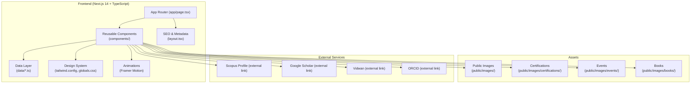

## 1. Architecture Design



**Architecture Principles**:
- Server Components by default for all static content sections (SEO + performance)
- Client Components only where required: Navbar scroll detection, mobile menu, publication filters, hover animations, scroll-triggered reveals
- Centralized data architecture: all content in `data/` files — UI components consume structured TypeScript data
- Strict separation of concerns: data layer independent from UI; data edits do not require UI restructuring

---

## 2. Technology Description

- **Frontend Framework**: Next.js 14 (App Router) + React 18 + TypeScript 5
- **Styling**: Tailwind CSS 3 (custom theme for navy/ivory palette + editorial typography)
- **Animations**: Framer Motion 11 (scroll-triggered reveals, staggered hero entrance, card hovers, timeline nodes)
- **Icons**: Lucide React (restrained usage, no cheesy icons)
- **Image Optimization**: Next.js `next/image` (responsive sizing, priority for hero, object-fit cover, proper alt text)
- **Initialization**: `npx create-next-app@latest` with TypeScript + Tailwind + ESLint + App Router + src/ directory
- **Build Tool**: Next.js built-in (Turbo/Webpack)
- **No Backend**: Static single-page portfolio, no database required, mock/placeholder data in TypeScript data files
- **Linting/Formatting**: ESLint + TypeScript strict mode (noUncheckedIndexedAccess, strictNullChecks)
- **No unnecessary libraries**: No UI component libraries, no state management libraries (React built-in state + URL params sufficient for filters)

---

## 3. Route Definitions

| Route | Purpose | Component Type |
|-------|---------|----------------|
| `/` (root) | Single-page portfolio with all sections (Hero → Footer) | Main Server Component, embeds Client Components where needed |

**Single page structure** (scroll-linked sections, each with id for nav anchor links):
- `#hero` — Hero section
- `#about` — About section
- `#research` — Research Interests + Research Profiles
- `#experience` — Academic Experience timeline
- `#education` — Education qualifications
- `#publications` — Selected Publications browser
- `#supervision` — PhD Supervision
- `#certifications` — Certifications gallery
- `#events` — Events & Academic Engagement
- `#achievements` — Recognition & Achievements
- `#books` — Books & Contributions
- `#memberships` — Professional Memberships
- `#contact` — Contact / Let's Connect
- Footer (no id, below contact)

---

## 4. API Definitions

No backend API required. All content is static and served from the data layer (TypeScript files). External URLs are defined as config variables and open directly in new tabs with `target="_blank" rel="noopener noreferrer"`.

---

## 5. Server Architecture Diagram

Not applicable. This is a static frontend-only single-page portfolio with no backend server or database.

---

## 6. Data Model

### 6.1 Data Model Definition

```mermaid
erDiagram
    PROFILE ||--o{ EXPERIENCE : has
    PROFILE ||--o{ EDUCATION : has
    PROFILE ||--o{ PUBLICATION : "selected publications"
    PROFILE ||--o{ RESEARCH_INTEREST : has
    PROFILE ||--o{ RESEARCH_PROFILE : "external profiles"
    PROFILE ||--o{ PHD_SCHOLAR : supervises
    PROFILE ||--o{ CERTIFICATION : has
    PROFILE ||--o{ ACADEMIC_EVENT : participates_in
    PROFILE ||--o{ ACHIEVEMENT : has
    PROFILE ||--o{ BOOK : authors
    PROFILE ||--o{ MEMBERSHIP : has
    PROFILE ||--|| CONTACT_INFO : "at"

    PROFILE {
        string name
        string title
        string department
        string institution
        string campus
        string biography
        Stat[] stats
    }
    EXPERIENCE {
        string yearRange
        string position
        string institution
        string description_optional
    }
    EDUCATION {
        string degree
        string branch
        string institution
        string year
    }
    PUBLICATION {
        string title
        string[] authors
        number year
        string venue
        string type
        string doi_optional
        string url_optional
        string category_optional
    }
    RESEARCH_INTEREST {
        string name
        string shortDescription_optional
    }
    RESEARCH_PROFILE {
        string platform
        string description
        string url
    }
    PHD_SCHOLAR {
        string name
        string researchArea
        string year
        string status
    }
    CERTIFICATION {
        string title
        string issuer
        string year
        string imagePath_optional
        string pdfPath_optional
        string externalUrl_optional
    }
    ACADEMIC_EVENT {
        string date
        string title
        string type
        string venue_optional
        string description_optional
        string imagePath_optional
    }
    ACHIEVEMENT {
        string title
        string issuer_optional
        string year_optional
        string description
        boolean featured
    }
    BOOK {
        string title
        string isbn_optional
        string publisher
        string year_optional
        string coverImage_optional
        string description_optional
    }
    MEMBERSHIP {
        string organization
        string logoText
    }
    CONTACT_INFO {
        string email
        string department
        string institution
        string address
        string[] researchProfileLinks
    }
```



### 6.2 Data File Structure

All data files live under `src/data/` (or `data/` at project root if no src prefix chosen during init). Each file exports a typed array/object:

```
src/data/
├── profile.ts          — Profile, stats, biography
├── experience.ts       — Experience[]
├── education.ts        — Education[]
├── research.ts         — ResearchInterest[] + ResearchProfile[] (with url placeholders)
├── publications.ts     — Publication[] (verified entries only; placeholders marked)
├── supervision.ts      — PhDScholar[] + supervision stats
├── certifications.ts   — Certification[] (placeholders if not provided)
├── events.ts           — AcademicEvent[]
├── achievements.ts     — Achievement[] (verified + featured flag)
├── books.ts            — Book[]
└── memberships.ts      — Membership[] (confirmed only)
```

Each data file uses clearly-marked placeholder syntax `'[Scholar information to be added]'`, `'[Google Scholar URL]'`, etc. — **never fabricated academic content**.

---

### 6.3 Component Architecture

```
src/components/
├── layout/
│   ├── Navbar.tsx          (Client: scroll state + mobile menu + scroll-linked nav)
│   └── Footer.tsx          (Server)
├── sections/
│   ├── Hero.tsx            (Client: staggered entrance animations)
│   ├── About.tsx           (Server, with Stats subcomponent)
│   ├── Stats.tsx           (Server)
│   ├── ResearchInterests.tsx (Client: hover state animations)
│   ├── ResearchProfiles.tsx  (Server)
│   ├── ExperienceTimeline.tsx (Client: scroll-triggered reveal)
│   ├── Education.tsx       (Server)
│   ├── PublicationList.tsx (Client: year filter + expandable cards)
│   ├── PublicationCard.tsx (Server or Client)
│   ├── PhDSupervision.tsx  (Server)
│   ├── CertificationGrid.tsx (Server; modal Client sub if used)
│   ├── EventTimeline.tsx   (Client: scroll reveal)
│   ├── Achievements.tsx    (Server)
│   ├── Books.tsx           (Server)
│   ├── Memberships.tsx     (Server)
│   └── Contact.tsx         (Server)
└── shared/
    ├── SectionHeading.tsx  (Server: eyebrow + number + heading + subheading)
    └── ui/                 (Reusable primitives: Button, Card, SectionWrapper)
        ├── Button.tsx
        ├── Card.tsx
        └── AnimatedSection.tsx (Client: scroll-triggered reveal wrapper)
```

**Server vs Client boundary rules**:
- All static content: Server Components (about, education, research cards, stats, memberships, books, contact, footer)
- Components with state/interaction: `'use client'` directive at top
  - Navbar (scroll listener, mobile menu)
  - Hero (Framer Motion entrance)
  - PublicationList (filter state + expand/collapse)
  - ResearchInterests (hover state highlight)
  - Timeline components (scroll-triggered via `whileInView`)
  - AnimatedSection wrapper (reusable scroll reveal)
